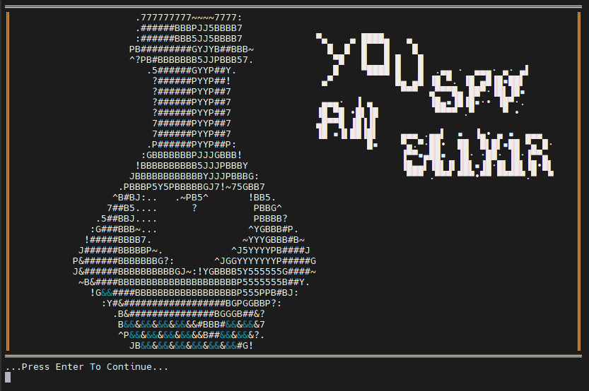
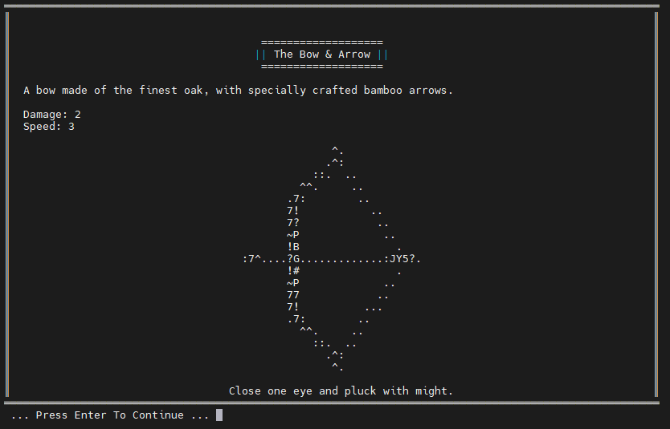
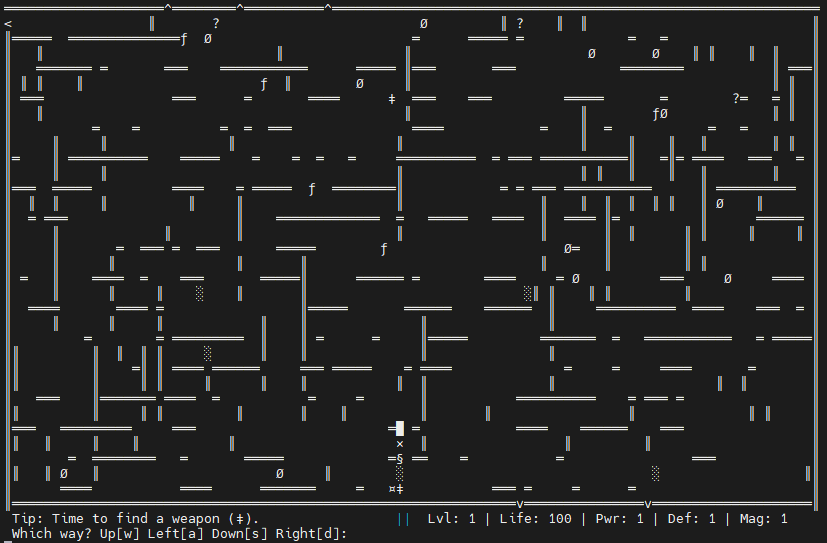
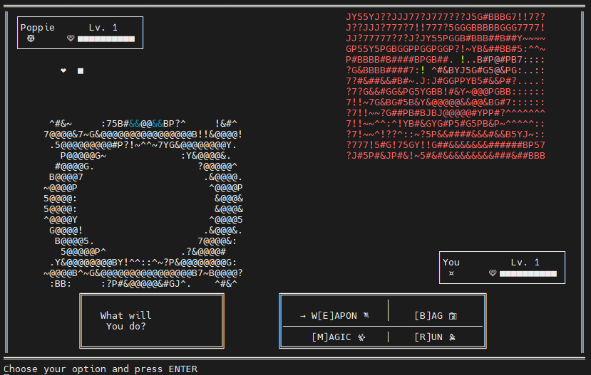
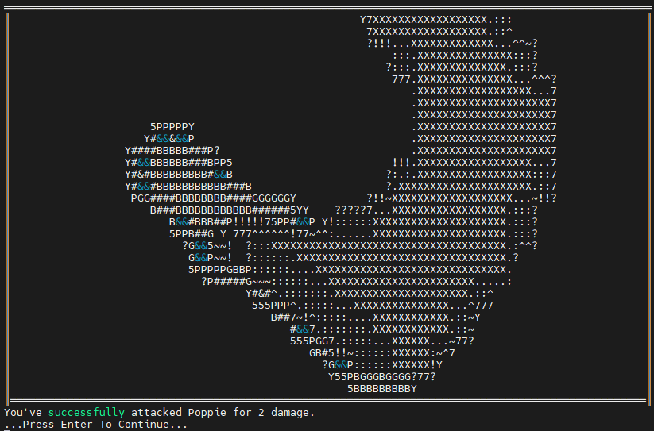
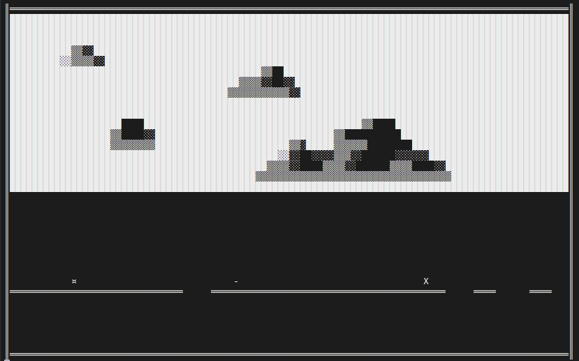
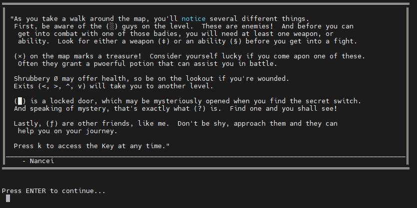

# RPG
an entire CLI RPG for Debian/Ubuntu

## Features
This is an RPG to be ran on a Debian/Ubuntu terminal.  Every level is procedurally generated, and you play as the character ¤.  You can find weapons, upgrades, potions, abilities, and NPCs.  Battle monsters and win (or lose), level up your character and stats, and play a side-scrolling shooter to advance between levels.

This is my first C++ game, and I've created this "masterpiece" using Nano and Notepad as my IDE (before I knew any better).  I've learned how to enable and switch between raw mode and cooked mode in terminal.  This project taught me the importance of asking for help, debugging, and using an IDE.

This game is about 90% complete, and fully playable.

## Screenshots

Finding a random potion on the map.

Obtaining a random weapon.

A procedurally generated map will change with each game run and level.

An enemy battle with some color.

Battle animations.

A side-scrolling shooter to change between levels.

A map key provided by an NPC.